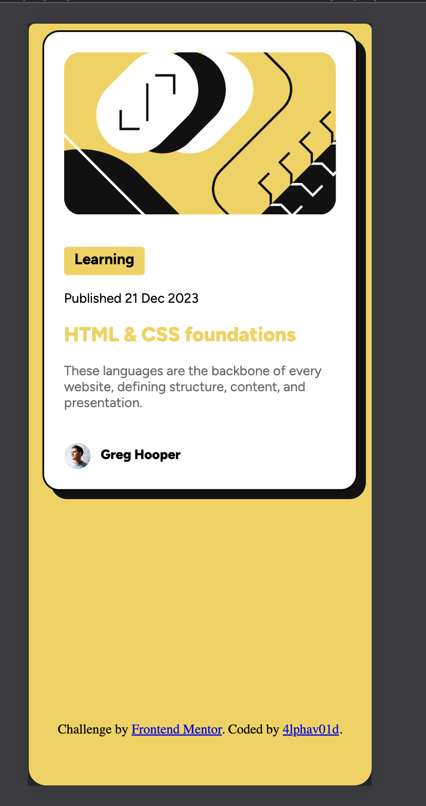
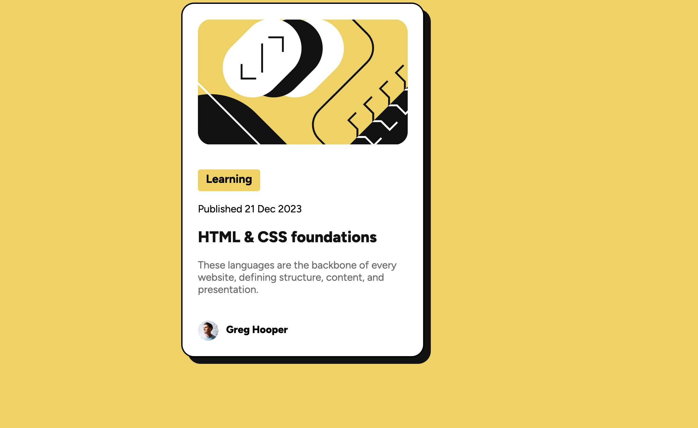

# Frontend Mentor - Blog preview card solution

This is a solution to the [Blog preview card challenge on Frontend Mentor](https://www.frontendmentor.io/challenges/blog-preview-card-ckPaj01IcS). Frontend Mentor challenges help you improve your coding skills by building realistic projects. 

## Table of contents

- [Overview](#overview)
  - [The challenge](#the-challenge)
  - [Screenshot](#screenshot)
  - [Links](#links)
- [My process](#my-process)
  - [Built with](#built-with)
  - [What I learned](#what-i-learned)
  - [Continued development](#continued-development)
  - [Useful resources](#useful-resources)
  - [AI Collaboration](#ai-collaboration)
- [Author](#author)

## Overview

### The challenge

Users should be able to:

- See hover and focus states for all interactive elements on the page

### Screenshot

### Links

- Solution URL: [Add solution URL here](https://your-solution-url.com)
- Live Site URL: [Add live site URL here](https://your-live-site-url.com)

## My process
First off, I used semantic html, css to build the barebones of the project and after that I started using css to style the html skeleton.

I applied flexbox quite a bit extensively because I noticed that it helps in making a robust layour for smaller interface.

In order to account for both large screens and mobile screens, I applied media queries. 

### Built with

- Semantic HTML5 markup
- CSS custom properties
- Flexbox
- CSS Grid
- Mobile-first workflow

### What I learned
I learned how to use flexboxes and media-queries on an intuitive basis. This was particularly important because reading about it too much without practicing it brought about decision paralysis. What I learned, "JUST DO IT". 

### Continued development
In future projects, I would love to focus on how to use Gridbox layout to make robust layouts. Depending on the project specifications, I am curious on how how to use media-queries to make landscaped layouts on mobile screens.

### Useful resources
- [CssTricks](https://css-tricks.com/snippets/css/a-guide-to-flexbox/) - This helped me in understanding the flexbox concept intuitively. I'd recommend it to anyone still trying to learn how flexbox works. What really makes it stand out is the images it has on there because it just reinforces an intuitive understanding of the concept. 

- [DeepSeek](https://www.chat.deepseek.com) - Using Deepeek V4 Flash as a code along partner really helped. I could easily ask it the dumbest question and it would guide me step by step till I understood the concept intuitively. 

### AI Collaboration

I used OpenCode extensively and the model harnessed was Deepseek V4 Flash. I used it because it's tokens are dead cheap and using it within OpenCode made the entire context of this project available to model. 

#### In Summary:
- Tools Used: OpenCode and Deepseek v4 Flash
- How I used them: I mostly used them in debugging and brainstorming solutions. 
- So far, it's been working really well, the combination does a bit of "over-spoon-feeding" but overall it's an amazing partner to work out things with. 

## Author

- Website - [My Github](https://github.com/4lphav01d)
- Frontend Mentor - [@4lphav01d](https://www.frontendmentor.io/profile/4lphav01d)

